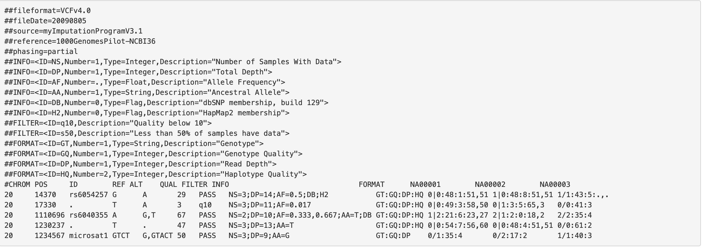
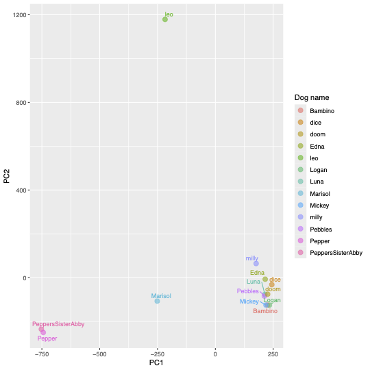
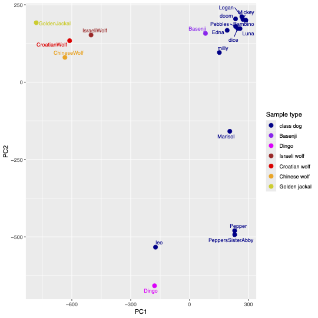

# AncestrySnpsToPcaDemo

## Inroduction
Many people are interested in the breed origins of their dogs. One will often hear people say things along the lines of: "My dog is definitely part dingo", or "I'm pretty sure Rex is a wolf hybrid", or "Fritz is a Carolina dog". Given preternatural curiosity and a non-trivial chunk of money, one can now get a better handle on the genetic ancestry of your canine pet by submitting a DNA sample via [Ancestry for dogs](https://petdna.ancestry.com/). Ancestry uses a genotyping array designed for dogs, which generates genotypes at hundreds of thousands of variable sites in the dog genome. The company then performs ancestry inference, comparing your dog's genotypes against those for a large panel of bered dogs, from which the percentages of ancestry from various breeds in your dog can be estimated.

This repository demonsrates how one would analyze the data yourself, if say you and a bunch of friends got back results for your dogs and wanted to compare them. There are some peculiar features of the genotyping array data in general, and the data provided by Ancestry in particular, and I show you how to deal with these issues so that you can do two things:

* merge all of the Ancestry-generated dog genotypes from a bunch of samples
* merge these with a panel of publicly available canid samples.

## The publicly available data
In this particular demo, we will merge the dog data with genotypes obtained from whole-genome sequencing for 6 canids: dingo, Bajenji, Chinese wolf, Croatian wolf, Israeli wolf, and Golden Jackal. These data were first published alongside a study investigating the timing and geographic origins of dogs [Freedman et al. 2014, *PLoS Genetics*](https://journals.plos.org/plosgenetics/article?id=10.1371/journal.pgen.1004016).
All samples were sequenced to relatively high coverage (approximately 20x each), meaning that, on average, enough sequencing reads overlap any particular site in the genome such that heterozygous sites can be genotyped with high confidence. 

## Data analysis: Ancestry samples
### PLINK files: 1st steps
PLINK is a software package for manipulating genotype array data. Unsurprisingly, PLINK also refes to a particular file format, or more specifically, a set of files that store genotypes that can be used with PLINK and other tools that can take PLINK format files as input. There are text-reader readible PLINK files (with one *ped,*fam, and *map file for each sample) and there are binary versions ("bim and *bed). As is typicaly in bioinformatics, the same prefix can be used for different software and different data analysis contexts, e.g. "bed" files also refer to flat text files that represent genomc intervals. If you decide to stay in biology and as a result, do a bit of data crunching, you will get used to this! Or, you won't and may wind up being the owner of a vegan bakery instead.

#### Counting the number of chromosomes
Annoyingly, genotype arrays can have a number of chromosomes, or have chromosome names that the PLINK software does not like. One can easily write *ped, *fam and *map files without every opening PLINK. But try and get PLINK to read your files, and, the headaches will begin. So, what we do is, first count the number of chromosomes. Because all of our example dog files from Ancestry have the same structure, we'll use the genotypes from Logan (the dog).

```bash
awk '{print $1}' Logan.map | awk '!a[$0]++'  |wc -l > number_chromosomes.txt
``

This is just a command line parsing of the map file (which contains the chromosome names of each genotyped site in the genotype array, and counts the unique values. If you open number_chromosomes.txt, it will tell you there are 82 chromosomes in the dog genome. The version of the genome is CanFam3.1 and there are **NOT** 82 chromosomes in that genome. There are a bunch of chromosomes, and a bunch of other shorter scaffolds that aren't chromosome-level scaffolds.

#### Create binary version of plink files
All we do here is, in the shell, create an array called samples, add sample names to it, then use PLINK to stick, one by name, the sample names in a search for the ped and map files and thenm output binary versions. The important thing here is that we explcitly set the number of chromosoems to 82 and use the *--allow-extra-chr* switch to tell PLINK not to comlain about the weird number of chromosomes.

```bash
samples=()
for f in *.ped; do samples+=("${f%.ped}");done
for i in $samples; do plink  --ped ${i}.ped --map ${i}.map --make-bed --chr-set 82  --allow-extra-chr --out ${i}_binary;done
```

#### Create a list of dog sample binary PLINK files 
Why do we need to do this? Becaue in order to merge the individual sample PLINK files into one that contains the genotypes of all of the Ancestry dogs, we need to supply a file that lists these files.

```bash
ls *.ped | sed 's/.ped$//' | while read i; do
  awk -v val="$i" 'BEGIN { print val"_binary.bed "val"_binary.bim "val"_binary.fam" }' |grep -v Bambino>> merge_list.txt
done
```

`grep -v` means we are excluding the dog named Bambino. Why? Because of PLINK weirdness, we need to supply the files for a particular sample (dog) and then a list of the other samples you want to merge with it. 

#### Merge dog binaries into multi-sample PLINK files
Once again, we need to specify arguments so that PLINK doesn't complain about the non-standard number of chromosomes, merging all the files corresponding to samples in merge_list.txt to those for Bambino:

```bash 
plink --bfile Bambino_binary --chr-set 82 --merge-list merge_list.txt --make-bed --out dogs_merged --allow-extra-chr
``` 

#### Convert merged dog files to vcf format
[vcf](https://gatk.broadinstitute.org/hc/en-us/articles/360035531692-VCF-Variant-Call-Format) format is the standard format for representing genotypes calculated using genome sequencing data, whether that be whole-genome sequencing or some form of "reduced representation" , such as when sequencing is done for targed regions of a genome, e.g. protein-coding genes. It contains a number of header fields that are "commented out" with "#" characters, that typically describe the chromosomes names in the file, and what various codes mean. The data part of the file describes which variants are observed and in which samples at a given genomic position, e.g.:





A few things to notice about vcf format. First, each row contains a REF and and an ALT allele. The REF allele is, not surprisingly the reference allele. For genotyping based off of aligning sequencing reads to a reference genome, the REF allele is the nucleotide observed at that position in the genome, which is typically represented in a haploid form, i.e. there is only one base. Second, the genotypes are reprsented by number combinations, with 0 denoting the REF allele and increasing integers referencing ALT alleles, which are listed in the ALT fields. It is entirely possible to have more than one alternative allele. So, if your REF allele is A, you have two alternative alleles, C and G, and a set of samples have the genotypes A/A,A/C, and A/G, they would be represented in the vcf file as 0/0, 0/1, and 1/2. If no genotype was called for a sample at a particular site, it will be represented as ./..

### Replace SNP chip ids with sample names in vcf file
SNP array chips such as those used by Ancestry have a unique chip ID. Unofortunately, that is the information in the original PLINK files treated as the sample name. Of course, that doesn't really help us in seeing what dogs share more genetic similarity, or their genetic distance from wild canids. I had to write a rather ugly one-liner to write a file that maps the array id to the dog names.

```bash
for i in *ped;do j=`head -1 $i |awk '{print $1"_"$2}'`; echo $i,$j |sed 's/.ped//' |sed 's/data//'| sed 's/a_31230811903758/a/' |sed 's/m_31230710411425/m/' >> name_to_array_id.txt;done
```

The first few lines of name_to_id.txt look like this:
```bash
Bambino,0_31230710006619
Edna,0_31230811903758
Logan,0_31230710006801
Luna,0_31230710006612
```

**NOTE**: this one-liners is not universally applicable to other arbitrary sets of dog samples--I was using a set of 13 of your dogs' genotypes, and there was some idiosyncratic naming that required I write the nonsense above. In prindiple, thre is probably a cleaner, more generalizable way of doing that, which I will try and add soon in case you want to revisit this whole workflow example

Anyway, I also wrote a short python script that takes the merged vcf file, and then replaces the array ids with the dogs names. It gets run very simply as:


```bash
python WriteNamesToVcf.py 
```

which produces namesfixed_dogs_merged.vcf, the vcf with dog names.

#### Compressing the merged dog vcf file
Downstream manipulations, filtering, and analysis of the merged vcf file will require access to particular sets of fields with a software package called [bcftools](). *bcftools* can do useful things like extracting the genotypes in a particular genomic region (or for a particular genomic position. However, we need to compress the vcf file with another tool that comes bundles with *bcftools*, called *bgzip*

```bash
bgzip namesfixed_dogs_merged.vcf
```

**NOTE**: For those of you familiar with *gzip*, gzipping a file is NOT the same as zipping it with *bgzip*!

#### Remove variants with "unknown value"
This is a rather surreal feature of PLINK format, and of genotyping arrays as well. It is possible to genotype a site for which the genommic position is unknown. PLINK format stores these in chromosome "0". I am extremely wary of sites that can't be ascribed to a known genomic position, and so it is best to filter them out. *bcftools* has a very straightforward way of doing this:

```bash
bcftools view -i 'POS>0' -Oz -o nounknown_namesfixed_dogs_merged.vcf.gz namesfixed_dogs_merged.vcf.gz
```

* `view` is a module for reading the file
* `-i` means include all records that pass filtering criteria
* `'-POS>0'` instructs bcftools to only include entires with a position >0; variants where chromosome is unknown (i.e. 0) also have a position of 0
* `-Oz` tells bcftools to output the results in bgzip-compressed format
* `-o` specifies the output file name
* the final argument is the input file name
where the first command line argument follows ther `-o` which means "name of the output file without chromosome 0", and the last argument is our input file.


#### Remove multi-allelic sites
Mult-allelic sites are often enriched for erroneous genotypes, with such errors arising from a number of factors, including local structural variation, and a particular genotyping algorithm incorrectly mistaking sequencing errors as alternative alleles. Furthermore, some downstream data analysis tools assume that sites are bi-allelic, i.e. having only two alleles. A similar logic can be applied to variants that are not simple nucleotide substitutions, such as an A for a G. Insertions and deletions, aka "indels" are cases where a sample has extra nucleotides inserted, or bases in the reference genome assembly that are missing. Indels are much harder to call correctly, and they are typically not the type of variant that is expected by downstream tools. Thus, it is normally useful to filter them out. 

We can remove multi-allelic and indel sites with *bcftools* as follows:

```bash
bcftools view -m2 -M2 -v snps nounknown_namesfixed_dogs_merged.vcf.gz -Oz -o dogs_biallelic_snps.merged.vcf.gz
```

#### Removing SNPs on unordered scaffolds
Genome assemblies are comprised of scaffolds,which are comprised of shorter sequences called contigs that are glued together in an inferred order. In most cases, there are a bunch of contigs that cannot be unambiguously scaffolded. As a result, they get dumped into a fake chromosomes, usually named "Un", which is created by concatenating all of the contigs that couldn't be scaffolded. There are also scaffolds that are not chromosome scale and often have longer alphanumeric names, rather than single digits such as 1 or "chr1" for chromosome 1. It is harder to assess the quality of the contig assemblies on Un, and any variants detected in them cannot be placed into any useful genomic context: we don't know fif they actually belong on a chromosome, and how far they are to other called variants, and we certainly can't tell if they are near any genes, so they don't really have any use for downstream functional analyses. Therefore, we can remove variants from Un:

```bash
gunzip -c dogs_biallelic_snps.merged.vcf.gz |grep -v Un > noUn_dogs_biallelic_snps.merged.vcf
```
This command line removes lines with Un in them, not just genotype data lines but comments in the header that reference Un scaffolds.

Also, we need to bgzip the output:
```bash
bgzip noUn_dogs_biallelic_snps.merged.vcf
``` 

#### Removing ambiguously named chromosomes
CanFam3.1 has 38 autosomes, an X, and and MT chromosome. But, the genotyping array has no X, but a 39,40 and 42 ... weird. 39 has a length
that is suspciously close to that of the X. But, we can't use the X for population structure because not all of the dogs are females, i.e. by
definition males will only have 0/0 or 1/1. No bueno. The others may or may not be larger scaffolds that have been named. So, we are going to dump them

```bash
bcftools view --targets ^39,40,42 noUn_dogs_biallelic_snps.merged.vcf.gz -O z -o chrfiltered_noUn_dogs_biallelic_snps.merged.vcf.gz
bcftools index chrfiltered_noUn_dogs_biallelic_snps.merged.vcf.gz
```

### Looking for variation in genes of interest.
In our paper looking at signals of positive selection on the dog genome that took place early in domestication, [Freedman et al, 2016 PLoS Genetics](https://journals.plos.org/plosgenetics/article?id=10.1371/journal.pgen.1005851), one of the genes near the strongest signal was nocturnin, CCRN4L, a gene that plays an important role in lipid metabolism. We can use *bcftools* to see if any of our SNPs overlaps this genic region, which we'll expand by adding 20kb to either side of it:

```bash
bcftools view -r 19:3568695-3629307 chrfiltered_noUn_dogs_biallelic_snps.merged.vcf.gz -o nocturnin_20kbbuffer_classdogs.vcf
```

**WAIT!!**. Something weird is happening. There appear to be more than one site with the same genomic coordinates:

```bash
19	3573889	AX-167376129	T	G	.	.	PR	GT	0/0	./.	./.	./.	0/0	0/1	./.	./.	0/0	0/0	./.	0/1	0/1
19	3573889	AX-168184528	T	G	.	.	PR	GT	./.	0/0	0/0	0/1	./.	./.	./.	0/0	./.	./.	0/0	./.	./.
19	3590517	AX-168283112	C	G	.	.	PR	GT	0/1	0/0	0/0	0/1	0/0	0/0	0/1	0/1	0/1	0/0	0/0	0/0	0/0
19	3610008	AX-167838398	G	A	.	.	PR	GT	0/0	0/0	0/1	0/0	0/1	0/1	0/1	0/1	0/0	1/1	0/0	0/1	0/1
19	3614797	AX-168252513	C	T	.	.	PR	GT	0/0	0/0	0/0	0/1	0/0	0/0	0/0	0/0	0/0	0/0	0/0	0/1	0/0
19	3619534	AX-168005459	C	T	.	.	PR	GT	0/0	0/0	0/1	0/0	0/1	0/1	0/1	0/1	0/0	1/1	0/0	0/1	0/1```

Unfortunately, PLINK has a problem in that without unambiguous reference allele information, it may guess, and also may split some multi-allelic records into multiple lines. So, we need to deal with that. First, we will create an updated merged vcf file that has the correct reference allele (this will also be needed to merge with genome-sequencing derived genotypes of other canids later on).

First, we need to index the genome, this time with [samtool](http://www.htslib.org/). I know ... use *samtools* so you can do something with *bcftools*? What can I say, it's bioinformatics ... if there is a way to make things overly complicated ... that will be the way it is done ...

```bash
samtools faidx Canis_lupus_familiaris.CanFam3.1.dna_sm.toplevel.fa
```

The correct the reference allele in the vcf file to match what is in the genome

```bash
bcftools norm --check-ref ws --fasta-ref headerfix_Canis_lupus_familiaris.CanFam3.1.dna_sm.toplevel.fa \ 
    chrfiltered_noUn_dogs_biallelic_snps.merged.vcf.gz -O z -o \ 
    refcorrected_chrfiltered_noUn_dogs_biallelic_snps.merged.vcf.gz > correct.log 2>&1
``` 

Then, we collapse the multi-line occurrences of a single position into a multi-allelic sites:

```bash
bcftools norm -m +any refcorrected_chrfiltered_noUn_dogs_biallelic_snps.merged.vcf.gz -o collapse2multi_refcorrected_chrfiltered_noUn_dogs_biallelic_snps.merged.vcf.gz
```
The output to the screen is:
```bash
Lines   total/split/joined/realigned/removed/skipped:	584627/0/4837/0/0/0
```
indicating that 4837 lines have been joined into multi-allelic sites.

Now ... let's index the new genotype file, remove the new multi-allelic sites,  and try to look at nocturnin again!

```bash
bcftools view -m2 -M2 -v snps collapse2multi_refcorrected_chrfiltered_noUn_dogs_biallelic_snps.merged.vcf.gz -Oz -o recleanmulti_refcorrected_chrfiltered_noUn_dogs_biallelic_snps.merged.vcf.gz
bcftools index recleanmulti_refcorrected_chrfiltered_noUn_dogs_biallelic_snps.merged.vcf.gz
bcftools view -r 19:3568695-3629307 recleanmulti_refcorrected_chrfiltered_noUn_dogs_biallelic_snps.merged.vcf.gz -o nocturnin_20kbbuffer_classdogs.vcf
```
and .. lo and behold ...
```bash
cat nocturnin_20kbbuffer_classdogs.vcf
#CHROM	POS	ID	REF	ALT	QUAL	FILTER	INFO	FORMAT	leo	dice	Luna	Bambino	PeppersSisterAbby	Logan	Pebbles	Marisol	Mickey	milly	Pepper	doom	Edna
19	3573889	AX-167376129;AX-168184528	T	G	.	.	PR	GT	0/0	0/0	0/0	0/1	0/0	0/1	./.	0/0	0/0	0/0	0/0	0/1	0/1
19	3590517	AX-168283112	C	G	.	.	PR	GT	0/1	0/0	0/0	0/1	0/0	0/0	0/1	0/1	0/1	0/0	0/0	0/0	0/0
19	3610008	AX-167838398	G	A	.	.	PR	GT	0/0	0/0	0/1	0/0	0/1	0/1	0/1	0/1	0/0	1/1	0/0	0/1	0/1
19	3614797	AX-168252513	C	T	.	.	PR	GT	0/0	0/0	0/0	0/1	0/0	0/0	0/0	0/0	0/0	0/0	0/0	0/1	0/0
19	3619534	AX-168005459	C	T	.	.	PR	GT	0/0	0/0	0/1	0/0	0/1	0/1	0/1	0/1	0/0	1/1	0/0	0/1	0/1
```

What we also see, is that the SNP at position 3573889 had the same two alleles (see above) and had the same genotypes but somehow they got split ... PLINK thing ... Ancestry pipeline issue? Who knows? The good news ... we now have very clean data!!

### visualizing genetic structure among your dogs: PCA
Principal components analysis (PCA) has a long history of use in quantifying and visualizing population structure. There has been much debate over what the observed patterns mean, and what underlying evolutionary processes produce them. Needless to say, PCA can be a reasonable good first peek.

I typically use [R](https://www.r-project.org/) for making figure, as well as doing a bunch of data crunching when it is enabled by built-in R packages. To make a PCA, you can do something like this, assuming you are somewhat familiar with R and know how to install packages:

```r
library(vcfR)
library(adegenet)
library(ggrepel)
library(tidyverse)
setwd("/Users/adamfreedman/Dropbox/seminar_talks/CUNY/")

## dogs only pca
dogs_vcf <- read.vcfR("recleanmulti_refcorrected_chrfiltered_noUn_dogs_biallelic_snps.merged.vcf.gz")
dogs_adegenet <- vcfR2genind(dogs_vcf)
# replace missing values based upon mean allele frequency
dogs_impute <- scaleGen(dogs_adegenet, NA.method = "mean")  
pca_result <- prcomp(dogs_impute, center = TRUE, scale. = FALSE)
pca_tibble <- as_tibble(pca_result$x) %>%
  mutate(dog_name=row.names(pca_result$x))

pca_plot <- pca_tibble %>% ggplot(aes(x=PC1,y=PC2,color=dog_name,label=dog_name)) +
  geom_point(size=3,alpha=0.6) +
  xlab("PC1") +
  ylab("PC2") +
  geom_text_repel(aes(label=dog_name),size=3,show.legend = FALSE) +
  guides(color = guide_legend(title = "Dog name"))
```
Which produces this:



### How does my dog relate to dingoes and wolves?
There has been extensive work on dog breeds and their geographic origins ... some are seen as more "ancient", having arisen earlier in dog history, dogs like Salukis and Basenjis for instance. Most dog breeds have actually arisen in the last few hundred years ... most being not all. As you will see in a PCA of your dogs and wolves, someone else's dog don't look like everyone else's regarding their ancestry ...

#### Merging class dog vcf and other canids
We need to merge the vcf files together in order to generate a PCA of all of them at once. Since we have already dealt with the reference allele correction this is pretty straightforward.

We only want the positions that are in the class dogs, so first we create a list of regions to keep in the merge:

```bash
gunzip -c recleanmulti_refcorrected_chrfiltered_noUn_dogs_biallelic_snps.merged.vcf.gz |grep -v "#" |awk '{print $1"\t"$2}' > classdata_regions_file.txt
```

Then, we can do the merge with a vcf file from *Freedman et al. 2014, *PLoS Genetics*, for the two dogs, 3 wolves and one golden jackal from that study, that has already been compressed with bgzip. 

```bash
bcftools merge --regions-file classdata_regions_file.txt recleanmulti_refcorrected_chrfiltered_noUn_dogs_biallelic_snps.merged.vcf.gz Freedman_etal_2014_PLoSGenet_6canids.vcf.gz -O z -o classdata_Freedmandata_merged.vcf.gz
```

#### PCA plot of merged canids
Now, we can do a PCA to examine relationships between your dogs and other breed samples, and wolves ...

```r
dogs_wolves_vcf <- read.vcfR("classdata_Freedmandata_merged.vcf.gz")
dogs_wolves_vcf_biallelic <- dogs_wolves_vcf[is.biallelic(dogs_wolves_vcf) & !is.indel(dogs_wolves_vcf), ]
dogs_wolves_adegenet <- vcfR2genind(dogs_wolves_vcf_biallelic)
# replace missing values based upon mean allele frequency
dogs_wolves_impute <- scaleGen(dogs_wolves_adegenet, NA.method = "mean")  
pca_result <- prcomp(dogs_wolves_impute, center = TRUE, scale. = FALSE)
pca_tibble <- as_tibble(pca_result$x) %>%
    mutate(sample_name=row.names(pca_result$x))

sample_type<-c(rep("class dog",13),"Basenji","Dingo","Israeli wolf","Croatian wolf","Chinese wolf","Golden jackal")
pca_tibble <-pca_tibble %>% mutate(sample_type=sample_type)
pca_tibble <- pca_tibble %>% mutate(sample_type=factor(sample_type,levels=c("class dog","Basenji","Dingo","Israeli wolf","Croatian wolf","Chinese wolf","Golden jackal")))
sample_labels<-c("class dog","Basenji","Dingo","Israeli wolf","Croatian wolf","Chinese wolf","Golden jackal")
merged_pca_plot <- pca_tibble %>% ggplot(aes(x=PC1,y=PC2,color=sample_type,label=sample_name)) +
            geom_point(size=3) +
            scale_color_manual(labels=sample_labels,values=c("darkblue", "purple","magenta", "firebrick","red","orange","yellow3")) + 
            geom_text_repel(aes(label=sample_name),size=3,show.legend = FALSE) +
            xlab("PC1") +
            ylab("PC2") +
            guides(color = guide_legend(title = "Sample type"))
``` 

...which produces:


